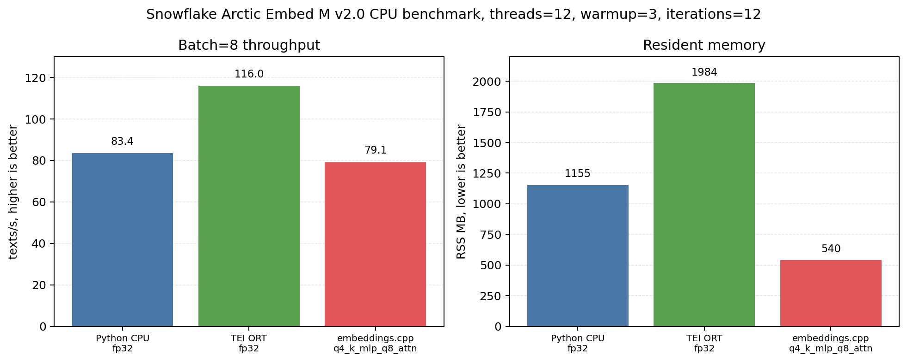
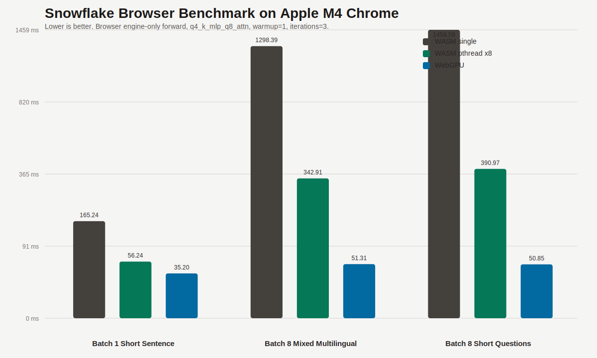

# embeddings.cpp

A C++ library for text (and maybe image) embeddings, focusing on efficient inference of BERT-like (and maybe clip-like) models.

## Overview

Many existing GGML-based text embedding libraries have limited support for Chinese text processing due to their custom tokenizer implementations. This project addresses this limitation by leveraging Hugging Face's Rust tokenizer implementation, wrapped with a C++ API to ensure consistency with the Python transformers library while providing native performance.

While currently focused on BERT-like text embedding models, the project aims to support image embedding models in the future (Work in Progress).

> **Note**: This is an experimental and educational project. It is not recommended for production use at this time.

## Supported Models

The following models have been tested and verified:
- BAAI/bge-m3
- BAAI/bge-base-zh-v1.5
- shibing624/text2vec-base-multilingual
- Snowflake/snowflake-arctic-embed-m-v2.0
- sentence-transformers/paraphrase-multilingual-MiniLM-L12-v2

The C++ implementation is checked against Python `transformers` CPU output. Models also supported by Hugging Face `text-embeddings-inference` can be checked against TEI as a third implementation. For repeatable correctness and performance runs, see `scripts/ALIGNMENT_README.md`.

## Model Preparation

First, install the required dependencies:
```bash
uv pip install --torch-backend cpu -r scripts/requirements.txt
```

Then convert the models to GGUF format:
```bash
# Convert BGE-M3 model
uv run scripts/convert.py BAAI/bge-m3 ./models/bge-m3.fp16.gguf f16

# Convert BGE-Base Chinese v1.5 model
uv run scripts/convert.py BAAI/bge-base-zh-v1.5 ./models/bge-base-zh-v1.5.fp16.gguf f16

uv run scripts/convert.py Snowflake/snowflake-arctic-embed-m-v2.0 ./models/snowflake-arctic-embed-m-v2.0.fp16.gguf f16

# Convert Text2Vec multilingual model
uv run scripts/convert.py shibing624/text2vec-base-multilingual ./models/text2vec-base-multilingual.fp16.gguf f16

uv run scripts/convert.py sentence-transformers/paraphrase-multilingual-MiniLM-L12-v2 ./models/paraphrase-multilingual-MiniLM-L12-v2.fp16.gguf f16
```

## Model Quantization

After converting models to GGUF format, you can quantize them to reduce memory usage and improve inference speed:

```bash
# Build the quantization tool
cmake --build build --target quantize

# Quantize a model (example with different quantization types)
./build/quantize ./models/bge-m3.fp16.gguf ./models/bge-m3.q4_k.gguf q4_k
./build/quantize ./models/bge-m3.fp16.gguf ./models/bge-m3.q6_k.gguf q6_k
./build/quantize ./models/bge-m3.fp16.gguf ./models/bge-m3.q8_0.gguf q8_0

# On Windows
.\build\Release\quantize.exe .\models\bge-m3.fp16.gguf .\models\bge-m3.q4_k.gguf q4_k
```

### Supported Quantization Types

- `q4_k`: 4-bit quantization with K-means clustering (good balance of size and quality)
- `q6_k`: 6-bit quantization with K-means clustering (higher quality, larger size)
- `q8_0`: 8-bit quantization (minimal quality loss, moderate size reduction)
- Other GGML quantization types as supported by the library

### Usage

```
quantize <input_model.gguf> <output_model.gguf> <qtype>
```

The quantization tool will:
1. Load the input GGUF model
2. Quantize eligible tensors (typically weight matrices)
3. Preserve metadata and non-quantizable tensors
4. Output size comparison and compression statistics

## Python Package Usage

Install embeddings.cpp:
```bash
pip install "embeddings-cpp[hub]"
```

Load the published Snowflake GGUF directly from Hugging Face:

```python
from embeddings_cpp import load

model = load("Snowflake/snowflake-arctic-embed-m-v2.0")
vectors = model.batch_encode(["hello world", "你好，世界"])
```

For machine-specific local builds, `GGML_NATIVE` can be enabled explicitly:

```bash
EMBEDDINGS_CPP_NATIVE=1 pip install --no-binary embeddings-cpp embeddings-cpp
```

PyPI wheels keep `GGML_NATIVE=OFF` so they run on a broad range of CPUs.

## Running From Source

Before running source tests, install embeddings.cpp from the checkout:
```bash
# use CMAKE_ARGS to add more cmake settings
$env:CMAKE_ARGS="-DGGML_VULKAN=ON"

# Install the package
pip install .

# Generate Python stub files
cd build && make stub

# on Windows
pip install pybind11-stubgen
# then
pybind11-stubgen embeddings_cpp -o .

python tests/test_tokenizer.py
```

## Alignment and Benchmarking

Run correctness checks for every model mentioned in this README:

```bash
uv run scripts/alignment.py --convert-missing
```

Include CPU performance comparisons:

```bash
uv run scripts/alignment.py --convert-missing --benchmark
```

For model benchmark work, use the registry-driven unified runner. It uses the
shared benchmark protocol and structured model config, and currently focuses on
Python CPU, TEI engine ORT, and `embeddings.cpp`:

```bash
uv run scripts/model_bench.py \
  --models BAAI/bge-m3 \
  --runners python_cpu embeddings_cpp tei_engine_ort \
  --quantizations q8_0 \
  --batch-sizes 1 4 8
```

`tei_engine_ort` requires a local `text-embeddings-inference` checkout at
`../text-embeddings-inference` or an explicit `--tei-repo-dir`.

For focused BGE-M3 single-request and batch validation without TEI:

```bash
uv run scripts/model_bench.py \
  --models BAAI/bge-m3 \
  --runners python_cpu embeddings_cpp \
  --convert-missing \
  --batch-sizes 1 4 8
```

By default the cosine thresholds are taken from the model registry and are used
as report tolerances, not process-failure gates. To explore looser product
tolerances, pass them explicitly:

```bash
uv run scripts/model_bench.py \
  --models BAAI/bge-m3 \
  --runners python_cpu embeddings_cpp \
  --batch-sizes 1 4 8 \
  --min-cos 0.95 \
  --batch-min-cos 0.95 \
  --quantized-batch-min-cos 0.95
```

For CI-style checks that should fail on tolerance misses, add
`--fail-on-threshold`.

To produce a Snowflake-style BGE-M3 optimization table with Python CPU as the
correctness and speed baseline, sweep k-quant variants and CPU repack modes:

```bash
cmake --build build --target quantize
uv run scripts/model_bench.py \
  --models BAAI/bge-m3 \
  --runners python_cpu embeddings_cpp \
  --convert-missing \
  --quantize-missing \
  --quantizations fp16 q8_0 q6_k q4_k \
  --repack-modes off on \
  --batch-sizes 1 4 8
```

The generated `model_bench_*.md` report includes correctness, raw performance,
optimization-sweep, and best-variant-by-batch tables under `scripts/output/`.
Stable benchmark summaries are kept under [`benchmarks/`](benchmarks/README.md)
and linked from the README instead of copying every model's full benchmark table
inline. New model reports should follow the shared
[`benchmarks/STANDARD.md`](benchmarks/STANDARD.md) protocol. The current BGE-M3
report is [`benchmarks/bge-m3.md`](benchmarks/bge-m3.md).

The benchmark report compares Python `transformers` CPU, `embeddings.cpp`, and
TEI when enabled for the model. For Snowflake on CPU, the only cross-implementation
format all three runners share is `fp32`, so the README keeps the fair
cross-runner table in `fp32` and moves `embeddings.cpp` quantization results to a
separate trade-off table.

Measured on this PC:

- CPU: Intel Xeon E5-2673 v3 @ 2.40GHz
- Cores: 12 vCPU, 1 socket, SMT off
- Memory: 62 GiB RAM
- OS: Ubuntu Linux 5.15
- Model: `Snowflake/snowflake-arctic-embed-m-v2.0`
- Fair baseline GGUF: `models/snowflake-arctic-embed-m-v2.0.fp32.gguf`
- Production GGUF: `models/snowflake-arctic-embed-m-v2.0.q4_k_mlp_q8_attn.gguf`

Fair cross-runner baseline, `threads=12`, `batch=8`, serial runs,
`scope=end_to_end`. This table keeps all three runners in `fp32` where the
comparison is like-for-like and uses the same realistic randomized text pool as
the production table below:

| Runner | Format | Mean ms | P50 ms | P95 ms | Text/s | RSS MB |
|---|---|---:|---:|---:|---:|---:|
| `python_cpu` | HF `fp32` | 144.25 | 97.91 | 354.04 | 55.46 | 1148.9 |
| `tei_engine` | ORT `fp32` | 102.62 | 92.49 | 117.58 | 77.96 | 1972.6 |
| `embeddings.cpp` | GGUF `fp32` | 249.68 | 233.98 | 311.03 | 32.04 | 1534.6 |

For this Snowflake CPU path, the TEI row above is mostly an ONNX Runtime
result, not a router result. TEI's ORT backend applies graph optimization on
this model. A future Candle-only TEI row would be a different backend and
should be reported as a separate line, not mixed into the main `fp32`
baseline.

Production comparator, `threads=12`, `batch=8`, `warmup=3`,
`iterations=12`, serial runs, `scope=end_to_end`. This table uses
`scripts/profile_snowflake.py` with its realistic randomized text pool and
includes tokenization on every runner. For Snowflake on this host, `p50/p95`
and RSS are the primary numbers; `mean` can be distorted by host jitter.

| Runner | Backend / Format | Mean ms | P50 ms | P95 ms | Text/s | RSS MB | Accuracy vs Python `fp32` |
|---|---|---:|---:|---:|---:|---:|---|
| `python_cpu` | HF `fp32` | 91.01 | 84.91 | 110.71 | 87.90 | 1157.0 | reference |
| `tei_engine_ort` | ORT `fp32` | 96.89 | 97.89 | 107.98 | 82.57 | 1965.3 | reference-level `fp32` |
| `embeddings.cpp` | GGUF `q4_k_mlp_q8_attn` | 90.02 | 92.43 | 94.23 | 88.87 | 543.1 | min cos `0.991448` |



With this production quantization, `embeddings.cpp` is in the same end-to-end
latency tier as Python CPU and TEI ORT on this host while using much less RSS.
Compared with TEI ORT, resident memory is about 3.6x lower. Compared with
Python CPU, resident memory is about 2.1x lower.

The mixed quantization keeps attention weights at `q8_0` and quantizes MLP
weights to `q4_K`. That is intentional: attention is more accuracy-sensitive on
this model, while the MLP dominates model size and benefits most from lower-bit
weights.

`embeddings.cpp` quantization trade-offs on the same machine, same `threads=12`,
same `batch=8`. These rows come from isolated per-quant sweeps:

| Quant | Size MB | Mean ms | Text/s | RSS MB | Worst Min Cos | Batch Min Cos |
|---|---:|---:|---:|---:|---:|---:|
| `fp16` | 591.3 | 128.87 | 62.08 | 888.3 | 0.999985 | 1.000000 |
| `q8_0` | 318.3 | 95.77 | 83.53 | 615.2 | 0.998978 | 1.000000 |
| `q6_k` | 247.8 | 98.51 | 81.21 | 545.0 | 0.992130 | 1.000000 |
| `q5_k` | 209.2 | 109.29 | 73.20 | 506.1 | 0.983449 | 1.000000 |
| `q5_0` | 209.2 | 139.20 | 57.47 | 506.2 | 0.984581 | 1.000000 |
| `q4_0_attnf16` | 211.6 | 67.87 | 117.88 | 508.4 | 0.983455 | 1.000000 |
| `q4_0_mlp_q5_0_attn` | 176.1 | 77.90 | 102.69 | 473.0 | 0.967307 | 1.000000 |
| `q4_0_mlp_q6_k_attn` | 179.7 | 69.51 | 115.09 | 476.6 | 0.978769 | 1.000000 |
| `q4_0_mlp_q8_attn` | 186.3 | 61.03 | 131.09 | 483.4 | 0.981470 | 1.000000 |
| `q4_k_mlp_attnf16` | 211.6 | 63.58 | 125.83 | 508.6 | 0.991325 | 0.999550 |
| `q4_k_mlp_q8_attn` | 186.3 | 58.86 | 135.91 | 483.3 | 0.991226 | 0.999321 |
| `q4_0` | 172.8 | 62.17 | 128.67 | 469.8 | 0.948146 | 1.000000 |
| `q4_k` | 172.8 | 47.41 | 168.74 | 469.7 | 0.936614 | 0.994469 |
| `q4_0_embf16` | 436.0 | 52.28 | 153.02 | 732.9 | 0.946242 | 1.000000 |
| `q4_0_mlpf16` | 289.2 | 158.27 | 50.55 | 586.4 | 0.956237 | 1.000000 |
| `q4_0_mlp_q4_k_attn` | 172.8 | 50.50 | 158.41 | 469.7 | 0.944264 | 0.997765 |

Observed on this CPU:

- `q8_0` is the conservative compression point: much lower RSS than `fp32`, with
  very small output drift.
- `q6_k` is the smallest config that still keeps `Worst Min Cos` above `0.99` in
  this Snowflake suite.
- `q4_k_mlp_q8_attn` is the current production default because it stays close to
  Python CPU and TEI ORT end-to-end latency while cutting RSS sharply.
- `q4_k`, `q4_0`, `q4_0_embf16`, and `q4_0_mlp_q4_k_attn` are fast, but the
  output drift is large enough that they are not the default recommendation for
  correctness-sensitive use.
- `q4_0_mlpf16` is neither fast nor especially accurate on this model, so it is
  not an attractive point in the trade-off space.

For Snowflake/GTE on CPU, `embeddings.cpp` now enables flash attention and CPU
repack by default; set `EMBEDDINGS_CPP_FLASH_ATTN=0` or
`EMBEDDINGS_CPP_CPU_REPACK=0` only when debugging or checking regressions.

Standalone benchmark runs also write JSON and Markdown reports under
`scripts/output/`:

```bash
uv run scripts/benchmark.py \
  --model-id Snowflake/snowflake-arctic-embed-m-v2.0 \
  --gguf-path models/snowflake-arctic-embed-m-v2.0.q4_k_mlp_q8_attn.gguf
```

Pin the C++ CPU thread count while tuning:

```bash
uv run scripts/alignment.py --benchmark --cpp-threads 8
```

For models also supported by `text-embeddings-inference`, start TEI as an additional comparator:

```bash
uv run scripts/alignment.py \
  --models Snowflake/snowflake-arctic-embed-m-v2.0 \
  --convert-missing \
  --tei-start \
  --benchmark
```

For registry-driven Snowflake checks against the optimized mixed GGUF:

```bash
uv run scripts/correctness.py --model-id Snowflake/snowflake-arctic-embed-m-v2.0 --benchmark
uv run scripts/benchmark.py \
  --model-id Snowflake/snowflake-arctic-embed-m-v2.0 \
  --gguf-path models/snowflake-arctic-embed-m-v2.0.q4_k_mlp_q8_attn.gguf
```

## Loading Published GGUF Models

Known optimized GGUF artifacts are listed in `embeddings_cpp/registry.json`.
The default Snowflake artifact is published under the `chux0519` Hugging Face
namespace.

- Model repository:
  `https://huggingface.co/chux0519/snowflake-arctic-embed-m-v2.0-gguf-embeddings-cpp`
- Direct GGUF file:
  `https://huggingface.co/chux0519/snowflake-arctic-embed-m-v2.0-gguf-embeddings-cpp/resolve/main/snowflake-arctic-embed-m-v2.0.q4_k_mlp_q8_attn.gguf`

```python
from embeddings_cpp import load

model = load("Snowflake/snowflake-arctic-embed-m-v2.0")
vectors = model.batch_encode(["hello world", "你好，世界"])
```

By default, CPU inference uses the detected CPU concurrency. Pin
`EMBEDDINGS_CPP_THREADS=N` only after measuring a specific host or container CPU
quota.

Install the optional Hugging Face dependency when downloading from the Hub:

```bash
pip install "embeddings-cpp[hub]"
```

## Browser Runtime

The Snowflake production artifact also runs in Chromium through browser WASM and
Browser builds are available for the Snowflake GGUF. The npm-facing browser
package currently defaults to stable single-thread `wasm`; `webgpu` is
experimental. It now includes dedicated kernels for several Snowflake-specific
GTE ops, but the browser backend still needs broader operator coverage and
browser-specific tuning before it should replace the default WASM path. The
older engine-only browser benchmark below is useful for backend tracking, but
it excludes tokenizer/package overhead and should not be read as the npm package
default.

Platform for the browser numbers below:

- Host: Mac mini `Mac16,10`
- CPU: `Apple M4`
- Memory: `16 GiB`
- OS: `macOS 26.3.1`
- Browser: `Google Chrome`
- Model: `models/snowflake-arctic-embed-m-v2.0.q4_k_mlp_q8_attn.gguf`
- Scope: browser `engine-only` forward, tokenizer excluded

| Scenario | WASM single-thread ms | WASM pthread x8 ms | WebGPU ms | WebGPU speedup vs pthread |
|---|---:|---:|---:|---:|
| `batch=1`, short sentence | 165.24 | 56.24 | 35.20 | 1.60x |
| `batch=8`, mixed multilingual batch | 1298.39 | 342.91 | 51.31 | 6.68x |
| `batch=8`, short question set | 1458.59 | 390.97 | 50.85 | 7.69x |



The static demo is at [demo/browser-wasm/index.html](/home/yongsheng/repos/embeddings.cpp/demo/browser-wasm/index.html),
and supports both preload-based bundles and dynamic `GGUF` download mode.
In downloaded mode, the page can fetch the published Snowflake `GGUF`, cache
the browser runtime bundle plus model bytes in `Cache Storage`, and reuse them
across reloads. The full method plus detailed numbers are in
[docs/BROWSER_BENCHMARK.md](/home/yongsheng/repos/embeddings.cpp/docs/BROWSER_BENCHMARK.md).

For browser correctness, the text-to-vector demo is checked against local
`embeddings.cpp` output with three default cases: Chinese, English, and
mixed-language input.

```bash
python3 scripts/browser_wasm_bench_server.py --host 127.0.0.1 --port 18081 --root "$PWD"
python3 scripts/browser_e2e_compare.py --base-url http://127.0.0.1:18081
```

## HTTP Server

The server can load a registered model from Hugging Face or a local GGUF path.
For a Snowflake deployment, `embeddings.cpp` is intended to replace a TEI CPU
setup.

### TEI Comparison

For `Snowflake/snowflake-arctic-embed-m-v2.0`, the deployment mapping is:

| Concern | TEI | embeddings.cpp |
|---|---|---|
| Container image | `ghcr.io/huggingface/text-embeddings-inference:cpu-1.9` | `ghcr.io/<owner>/embeddings-cpp-server:<tag>` or a locally built image |
| Model source | Hugging Face model repo | Registered optimized GGUF from `chux0519/snowflake-arctic-embed-m-v2.0-gguf-embeddings-cpp` or `--gguf-path` |
| Main request path | `POST /embed` | `POST /embed` |
| OpenAI-style path | not the primary TEI path | `POST /v1/embeddings` |
| Batch token guard | `--max-batch-tokens` | `--max-batch-tokens` |
| Thread control | TEI runtime defaults | detected CPU concurrency by default, override with `--threads` or `EMBEDDINGS_CPP_THREADS` only after measurement |
| Health probes | `/health` | `/health`, `/ready`, `/info` |

The TEI Snowflake command:

```bash
mkdir -p .cache/tei

docker run --rm -p 8081:80 \
  -v "$PWD/.cache/tei:/data" \
  ghcr.io/huggingface/text-embeddings-inference:cpu-1.9 \
  --model-id Snowflake/snowflake-arctic-embed-m-v2.0 \
  --max-batch-tokens 8192
```

Reusing `.cache/tei` avoids downloading the same TEI model artifacts again on
every benchmark run.

The equivalent `embeddings.cpp` server run is:

```bash
python -m embeddings_cpp.server \
  --model-id Snowflake/snowflake-arctic-embed-m-v2.0 \
  --port 8080 \
  --max-batch-tokens 8192
```

Build and run the Docker image locally:

```bash
docker build -t embeddings-cpp-server:local .

docker run --rm -p 8080:80 \
  embeddings-cpp-server:local \
  --model-id Snowflake/snowflake-arctic-embed-m-v2.0 \
  --max-batch-tokens 8192
```

Endpoints:

- `GET /health`
- `GET /ready`
- `GET /info`
- `POST /embed` with `{"inputs": ["hello", "world"]}`
- `POST /v1/embeddings` with an OpenAI-compatible embeddings request

For client compatibility, the main request surfaces are:

- TEI: `POST /embed`
- embeddings.cpp: `POST /embed`
- OpenAI-style clients: `POST /v1/embeddings`

For correctness work, the Snowflake path is checked against both Python
`transformers` CPU output and TEI. See `docs/TEST_MATRIX.md` and
`scripts/server_compare.py`. For performance work, `scripts/alignment.py` and
`scripts/benchmark.py` report both inference speed and RSS memory.

Container images can be published to GHCR with
`.github/workflows/publish-server-image.yml`, which publishes tags in the form
`ghcr.io/<owner>/embeddings-cpp-server:<tag>`.

## Building from Source

### macOS (ARM)

Configure and build with Metal support:
```bash
cmake -DCMAKE_EXPORT_COMPILE_COMMANDS=ON \
      -DGGML_METAL=ON \
      -DGGML_METAL_EMBED_LIBRARY=ON \
      -DEMBEDDINGS_CPP_ENABLE_PYBIND=ON ..
```

If you encountered openmp's bug, try

> brew install libomp
>
> export OpenMP_ROOT=$(brew --prefix)/opt/libomp

### Windows

build with vulkan support:

```powershell
cmake -DGGML_VULKAN=ON -DEMBEDDINGS_CPP_ENABLE_PYBIND=ON ..
# If you encounter any issues, ensure that your graphics driver and Vulkan SDK versions are compatible.
# You can also add -DGGML_VULKAN_DEBUG=ON -DGGML_VULKAN_VALIDATE=ON for debuging
```

## Debugging

GGML debug support is now enabled by default in the vendored version. This provides better debugging capabilities for CPU backend operations without requiring additional patches.

For more information about GGML debugging features, see: https://github.com/ggml-org/ggml/discussions/655
